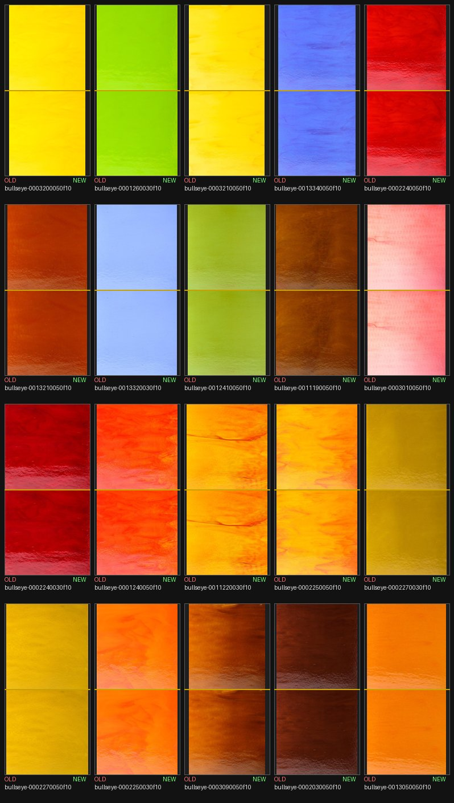

# Library picker rebuild -- before/after report

Generated by `scripts/build_swatch_library.py` (iteration 036). Existing registry entries compared: 1269. Final registry entries: 1332.

## Image changed per manufacturer

| Manufacturer | Changed | Unchanged | New | Newly Quarantined | Stability-kept (would-have-churned, blocked) |
|---|---:|---:|---:|---:|---:|
| Bullseye | 232 | 272 | 63 | 0 | 92 |
| Oceanside | 0 | 283 | 0 | 0 | 0 |
| Wissmach | 0 | 217 | 0 | 0 | 0 |
| Youghiogheny | 0 | 265 | 0 | 0 | 0 |
| **Total** | **232** | **1037** | **63** | **0** | **92** |

## Stability rule

Anti-churn margin threshold: **0.15** (picker FLOOR is 0.45). An image is only swapped when the picker's score for the new pick exceeds the currently-shipped image's own score by more than this margin (and only when the shipped image itself still clears FLOOR -- a known-bad image is never protected). See `apply_stability_rule()` docstring in build_swatch_library.py for the full rationale. 92 product(s) had a picker disagreement suppressed by this rule this run.

## Maintainer validation cases

- `granite ripple`: final id `youghiogheny-yu51914`, image unchanged, `/assets/catalog_images/youghiogheny-yu51914.jpg` (pick_score=1.4427)
- `steel grey opal`: NOT FOUND in final registry (possibly quarantined or SKU-filtered)
- `steel gray opal`: final id `youghiogheny-y700hs`, image unchanged, `/assets/catalog_images/youghiogheny-y700hs.jpg` (pick_score=1.4767)
- Bullseye Reactive Cloud (000009-*): 2 entries in final registry (KEEP+crop per Decision 3 -- the -v2 recovery, cropped to x:[650,1200] of its 1200x1200 frame, excludes the reaction-demo tile corner insert entirely; see REACTIVE_CLOUD_CROP_OVERRIDE).

## Bullseye churn gate -- picks deliberately kept (fix/bullseye-grip-picks)

47 Bullseye product(s) had a picker disagreement that was NOT the diagnosed flat-chip -> whole-sheet/grip upgrade; per the task guardrail ("if detection is uncertain, keep the current pick"), the currently-shipped image was kept. See `apply_bullseye_churn_gate()`.

| id | name |
|---|---|
| bullseye-0033450072f1010 | Cranberry Pink, Emerald Green, White 3+ Color Mix, Ripple, 3 mm, Fusible |
| bullseye-0001000058f1010 | Black Opalescent, Thin-rolled, Iridescent, gold, 2 mm, Fusible |
| bullseye-0001000048f1010 | Black Opalescent, Prismatic Texture, Iridescent, rainbow, 3 mm, Fusible |
| bullseye-0001000046f1010 | Black Opalescent, Accordion Texture, Iridescent, rainbow, 3 mm, Fusible |
| bullseye-0035010000f1010 | White, Aventurine Green, Caramel Opalescent 3+ Color Mix, Single-rolled, 3 mm, Fusible |
| bullseye-0033280000f1010 | White, Deep Royal Purple, Cranberry Pink 3+ Color Mix, Single-rolled, 3 mm, Fusible |
| bullseye-0031230000f1010 | White, Orange Opalescent, Aventurine Green 3+ Color Mix, Single-rolled, 3 mm, Fusible |
| bullseye-0023050000f1010 | White, Salmon Pink Opal 2-Color Mix, Single-rolled, 3 mm, Fusible |
| bullseye-0022090000f1010 | Dark Brown, White 2-Color Mix, Single-rolled, 3 mm, Fusible |
| bullseye-0021090000f1010 | White, Dark Brown 2-Color Mix, Single-rolled, 3 mm, Fusible |
| bullseye-0014090038f1010 | Light Bronze Transparent, Double-rolled, Iridescent, gold, 3 mm, Fusible |
| bullseye-0002430050f1010 | Translucent White Translucent, Thin-rolled, 2 mm, Fusible |
| bullseye-0001610050f1010 | Robin's Egg Blue Opalescent, Thin-rolled, 2 mm, Fusible |
| bullseye-0001420050f1010 | Neo-Lavender Opalescent, Thin-rolled, 2 mm, Fusible |
| bullseye-0001130050f1010 | White Opalescent, Thin-rolled, 2 mm, Fusible |
| bullseye-0012470031f1010 | Light Mineral Green Transparent, Double-rolled, Iridescent, rainbow, 3 mm, Fusible |
| bullseye-0014640031f1010 | True Blue Transparent, Double-rolled, Iridescent, rainbow, 3 mm, Fusible |
| bullseye-0014490031f1010 | Oregon Gray Transparent, Double-rolled, Iridescent, rainbow, 3 mm, Fusible |
| bullseye-0014390050f1010 | Khaki Transparent, Thin-rolled, 2 mm, Fusible |
| bullseye-0014290050f1010 | Light Silver Gray Transparent, Thin-rolled, 2 mm, Fusible |
| bullseye-0014280050f1010 | Light Violet Transparent, Thin-rolled, 2 mm, Fusible |
| bullseye-0014220050f1010 | Lemon Lime Green Transparent, Thin-rolled, 2 mm, Fusible |
| bullseye-0014140050f1010 | Light Sky Blue Transparent, Thin-rolled, 2 mm, Fusible |
| bullseye-0013220031f1010 | Garnet Red Transparent, Double-rolled, Iridescent, rainbow, 3 mm, Fusible |
| bullseye-0013110050f1010 | Cranberry Pink Transparent, Thin-rolled, 2 mm, Fusible |
| bullseye-0013110031f1010 | Cranberry Pink Transparent, Double-rolled, Iridescent, rainbow, 3 mm, Fusible |
| bullseye-0012340051f1010 | Violet Striker Transparent, Thin-rolled, Iridescent, rainbow, 2 mm, Fusible |
| bullseye-0012340031f1010 | Violet Striker Transparent, Double-rolled, Iridescent, rainbow, 3 mm, Fusible |
| bullseye-0012290031f1010 | Pewter Transparent, Double-rolled, Iridescent, rainbow, 3 mm, Fusible |
| bullseye-0012170050f1010 | Leaf Green Transparent, Thin-rolled, 2 mm, Fusible |
| bullseye-0011160031f1010 | Turquoise Blue Transparent, Double-rolled, Iridescent, rainbow, 3 mm, Fusible |
| bullseye-0011140031f1010 | Deep Royal Blue Transparent, Double-rolled, Iridescent, rainbow, 3 mm, Fusible |
| bullseye-0011070051f1010 | Light Green Transparent, Thin-rolled, Iridescent, rainbow, 2 mm, Fusible |
| bullseye-0003370050f1010 | Butterscotch Opalescent, Thin-rolled, 2 mm, Fusible |
| bullseye-0003340050f1010 | Gold Purple Opalescent, Thin-rolled, 2 mm, Fusible |
| bullseye-0003090030f1010 | Cinnabar Opalescent, Double-rolled, 3 mm, Fusible |
| bullseye-0003010030f1010 | Pink Opalescent, Double-rolled, 3 mm, Fusible |
| bullseye-0001420030f1010 | Neo-Lavender Opalescent, Double-rolled, 3 mm, Fusible |
| bullseye-0023100030f1010 | White, Cranberry Pink 2-Color Mix, Double-rolled, 3 mm, Fusible |
| bullseye-0023050030f1010 | White, Salmon Pink Opal 2-Color Mix, Double-rolled, 3 mm, Fusible |
| bullseye-0023040030f1010 | White, Lavender Blue Opal 2-Color Mix, Double-rolled, 3 mm, Fusible |
| bullseye-0021070030f1010 | White, Light Green 2-Color Mix, Double-rolled, 3 mm, Fusible |
| bullseye-0018310030f1010 | Ruby Pink Striker Tint, Double-rolled, 3 mm, Fusible |
| bullseye-0018240030f1010 | Ruby Red Striker Tint, Double-rolled, 3 mm, Fusible |
| bullseye-0014420030f1010 | Neo-Lavender Shift Transparent, Double-rolled, 3 mm, Fusible |
| bullseye-0014220030f1010 | Lemon Lime Green Transparent, Double-rolled, 3 mm, Fusible |
| bullseye-0014050051f1010 | Light Plum Transparent, Thin-rolled, Iridescent, rainbow, 2 mm, Fusible |

## Quarantined this run (picker)

25 product(s) had no gallery candidate clear the picker floor (0.45) and were excluded rather than shipping a bad photo.

| id | manufacturer | name |
|---|---|---|
| bullseye-0041210000f1010 | Bullseye | Light Pink and White on Clear Clear Base Collage, Single-rolled, 3 mm, Fusible |
| bullseye-0041210000fhalf | Bullseye | Light Pink and White on Clear Clear Base Collage, Single-rolled, 3 mm, Fusible |
| bullseye-0041110000f1010 | Bullseye | AUTUMN: Orange, Yellow, and Red on Clear Clear Base Collage, Single-rolled, 3 mm, Fusible |
| bullseye-0041110000fhalf | Bullseye | AUTUMN: Orange, Yellow, and Red on Clear Clear Base Collage, Single-rolled, 3 mm, Fusible |
| bullseye-0041110000ffull | Bullseye | AUTUMN: Orange, Yellow, and Red on Clear Clear Base Collage, Single-rolled, 3 mm, Fusible |
| bullseye-0040140000f1010 | Bullseye | Spring Green and Deep Pink on White Lacy White Base Collage, Single-rolled, 3 mm, Fusible |
| bullseye-0040140000fhalf | Bullseye | Spring Green and Deep Pink on White Lacy White Base Collage, Single-rolled, 3 mm, Fusible |
| bullseye-0040140000ffull | Bullseye | Spring Green and Deep Pink on White Lacy White Base Collage, Single-rolled, 3 mm, Fusible |
| bullseye-002249ca37fhalf | Bullseye | White, Light Silver Gray 2-Color Mix, Cascade, Iridescent, silver, 3 mm, Fusible |
| bullseye-002249ca37ffull | Bullseye | White, Light Silver Gray 2-Color Mix, Cascade, Iridescent, silver, 3 mm, Fusible |
| bullseye-0010190050f1010 | Bullseye | Red Reactive Clear Transparent, Thin-rolled, 2 mm, Fusible |
| bullseye-0010190050fhalf | Bullseye | Red Reactive Clear Transparent, Thin-rolled, 2 mm, Fusible |
| bullseye-0010150050f1010 | Bullseye | Alchemy Clear Silver to Gold Transparent, Thin-rolled, 2 mm, Fusible |
| bullseye-0010150050fhalf | Bullseye | Alchemy Clear Silver to Gold Transparent, Thin-rolled, 2 mm, Fusible |
| bullseye-0000130030fhalf | Bullseye | Opaque White Opalescent, Double-rolled, 3 mm, Fusible |
| bullseye-0000130030ffull | Bullseye | Opaque White Opalescent, Double-rolled, 3 mm, Fusible |
| bullseye-0010190030f1010 | Bullseye | Red Reactive Clear Transparent, Double-rolled, 3 mm, Fusible |
| bullseye-0010190030fhalf | Bullseye | Red Reactive Clear Transparent, Double-rolled, 3 mm, Fusible |
| bullseye-0010190030ffull | Bullseye | Red Reactive Clear Transparent, Double-rolled, 3 mm, Fusible |
| bullseye-0010150030f1010 | Bullseye | Alchemy Clear Silver to Gold Transparent, Double-rolled, 3 mm, Fusible |
| bullseye-0010150030fhalf | Bullseye | Alchemy Clear Silver to Gold Transparent, Double-rolled, 3 mm, Fusible |
| bullseye-0010150030ffull | Bullseye | Alchemy Clear Silver to Gold Transparent, Double-rolled, 3 mm, Fusible |
| bullseye-0010090030f1010 | Bullseye | Reactive Ice Transparent, Double-rolled, 3 mm, Fusible |
| bullseye-0010090030fhalf | Bullseye | Reactive Ice Transparent, Double-rolled, 3 mm, Fusible |
| bullseye-0010090030ffull | Bullseye | Reactive Ice Transparent, Double-rolled, 3 mm, Fusible |

## Contact sheet

20 most significant image changes (maintainer validation cases prioritized, then largest picker-score margin). Old pick on top, new pick on bottom of each cell.

