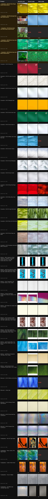

# VLM forced-choice judge -- swatch image-selection pilot

Pilot sample: **41** products (4 user-named Oceanside failures + a mix of additional Oceanside/Bullseye/Wissmach/Youghiogheny products spanning both suspicious-looking and clean-looking heuristic picks, seed 42, see `scripts/vlm_pick_judge.py:select_sample`). Each product's FULL live gallery was re-scraped (the registry only retains the winning URL); every candidate went into one numbered contact sheet judged once by `claude -p --model sonnet` and once by `claude -p --model haiku`, forced-choice, with one parse retry. Code: `scripts/vlm_pick_judge.py` (collection), `scripts/vlm_judge_report.py` (this report + the board). Registry was read-only throughout.

## Verdict on the 4 user-named failures

(5 registry rows -- "Dark Green with White" exists as two SKUs; the failure was on `of3296s`, and `of3276s` is included for coverage. Verdicts hand-verified against the contact sheets, not just inferred from index disagreement.)

| Product | Heuristic | Sonnet | Haiku | Verdict |
|---|---|---|---|---|
| Oceanside 96 COE Yellow Rough Rolled (`oceanside-of161rr`) | #1 | #2 | #2 | **FIXED** -- heuristic #1 is the reported perspective side view of the sheet on a tiled floor; both judges picked #2, a straight-on flat shot of the yellow rough-rolled texture |
| Oceanside 96 COE Hydrangea Blue Opal (`oceanside-of23071s`) | #4 | #1 | #1 | **FIXED** -- heuristic #4 is the reported shop-shelf photo (warehouse light wall, outlet boxes, bins); both judges picked #1, the flat blue sheet on a plain ground |
| Oceanside 96 COE Dark Amber with White Wispy (`oceanside-of3176s`) | #3 | NONE | NONE | **IMPROVED (NONE)** -- heuristic #3 is the reported garden photo (sheet leaning on a birch tree over strawberry plants); both judges said NONE, which would quarantine the product instead of shipping the garden shot. Conservative call: candidate #1 (a flat close-up of the wispy amber glass) arguably qualifies -- the judges likely read it as a macro crop rather than a full-frame sheet. Net: the bad image is gone; a usable-but-debatable one was left on the table |
| Oceanside 96 COE Dark Green with White (`oceanside-of3276s`) | #2 | #1 | #1 | **N/A -- already fine** -- the live gallery has changed since the user report; the heuristic's current pick (#2) is itself a flat green sheet. Both judges picked #1, an equally-legitimate flat alternate, and both avoided the shop-shelf photo (#3) still lurking in this gallery |
| Oceanside 96 COE Dark Green with White (`oceanside-of3296s`) | #2 | #1 | #1 | **FIXED** -- heuristic #2 is a hand holding the sheet up in front of a finished stained-glass window scene (the reported "finished window" failure); both judges picked #1, the flat wispy green sheet |

**Bottom line: yes, the judge fixes the named failures.** Of the 4 user-reported bad picks, 3 are outright fixed (both models independently choose a verified straight-on flat swatch photo), and the 4th (Dark Amber) has its garden photo removed via a NONE/quarantine verdict rather than replaced. Zero parse failures and zero retries across all 82 calls. Every one of these failures carried a *high* heuristic pick_score (1.0-1.5, well above the 0.45 floor) -- the pixel heuristic was not just wrong, it was confidently wrong, which is the finding that shapes the recommendation below.

## Agreement stats

- Sonnet vs. heuristic: **24/41** (59%)
- Haiku vs. heuristic: **21/41** (51%)
- Sonnet vs. haiku (model self-agreement): **30/41** (73%)
- Sonnet parse failures (both attempts unparseable): 0/41
- Haiku parse failures (both attempts unparseable): 0/41

## NONE-rate (no candidate qualifies)

- Sonnet: **1/41** (2%) -- `oceanside-of3176s`
- Haiku: **5/41** (12%) -- `oceanside-of3176s`, `oceanside-of152s`, `oceanside-of6237s`, `wissmach-wf28105`, `youghiogheny-ywaterltsp`

The two models' NONE behavior differs materially. Sonnet's single NONE (`of3176s`, Dark Amber) is a defensible quarantine -- that gallery's remaining candidates are a comparison shot, a garden photo, and a debatable macro. Haiku's 4 additional NONEs were spot-checked and at least one is a clear false NONE: `oceanside-of152s` has exactly one candidate, a clean straight-on flat red sheet with a small vendor watermark in the corner (which the build pipeline already crops for Oceanside), and haiku rejected it -- most plausibly reading the watermark as 'packaging/label'. Sonnet accepted it. Haiku is systematically more conservative, and its NONEs need a second opinion before they can drive quarantine decisions.

A *genuine* NONE (sonnet-grade) is exactly the case for adding a second scrape source (e.g. Delphi Glass) for those specific products -- the vendor's own gallery does not contain a usable flat swatch photo, which no smarter picker (heuristic or VLM) can fix by re-scoring the same images. Projected over the corpus at sonnet's measured rate, that is roughly 30-61 products needing an alternate source -- small enough to handle as a follow-up scrape, not a blocker.

## Latency & cost (measured, this pilot)

| Model | Avg latency/call | Avg cost/call | Pilot total time | Pilot total cost |
|---|---:|---:|---:|---:|
| Sonnet | 9.0s | $0.0533 | 370s | $2.18 |
| Haiku | 11.6s | $0.0168 | 474s | $0.69 |

## Projected corpus-wide cost/time (1269 products, judge-everything, sequential, one call/product/model)

| Model | Projected cost | Projected wall time (sequential, 1 call at a time) |
|---|---:|---:|
| Sonnet | $67.60 | 3.2h |
| Haiku | $21.26 | 4.1h |
| Both models (this pilot's design) | $88.85 | 7.3h (or ~4.1h if the two models' calls are run concurrently) |

Wall time scales down roughly linearly with parallel subprocess workers (these are independent per-product `claude -p` calls with no shared state); 10-way parallelism -- respecting the CDN scrape throttle for any *new* re-scraping, which a corpus-wide run would only need once, already covered by the existing thumb cache -- brings sonnet-only judge-everything to roughly 0.3h wall time.

## Recommendation

**Judge-everything, once, with sonnet -- then judge only new/changed products.** The judge-only-when-heuristic-is-unconfident design is NOT viable on this evidence, for one decisive reason: every one of the 4 user-named failures carried a high heuristic pick_score (1.0-1.5, vs. the 0.45 floor). The heuristic's confidence signal does not correlate with these failure modes (shelf photos, garden shots, hand-held-against-window all score as 'great swatch' on pixel statistics), so a confidence-gated judge would have skipped exactly the products the lead needs fixed. There is no usable 'unconfident' trigger to gate on.

Model choice: **sonnet, not haiku, despite 3x the cost.**

1. Haiku reproduces sonnet's verdict on only 30/41 products (73%), and its extra NONEs include at least one verified false NONE (`of152s`, a clean single-candidate flat sheet). A false NONE quarantines a good product -- the most expensive error class for the library (silent catalog shrinkage).
2. The absolute cost gap at corpus scale is $68 vs $21 -- a one-time ~$46 premium to avoid re-adjudicating haiku's conservative NONEs by hand. Not worth optimizing.
3. Haiku was not even faster in practice (11.6s vs 9.0s avg/call in this pilot -- CLI session overhead dominates, not model inference).

Operational shape:

1. One-time sonnet backfill over all 1269 products: ~$68, ~3.2h sequential or well under an hour at 10-way parallelism (independent subprocess calls; the gallery re-scrape is throttled but one-time and cacheable).
2. Where the judge disagrees with the shipped image, route through the existing stability-rule posture: replace when the judge picks a different candidate, quarantine on NONE -- but human-review the NONEs (sonnet's NONE-rate is low enough to eyeball: projected ~30-61 products corpus-wide) and treat persistent NONEs as the queue for a second scrape source (Delphi).
3. Going forward, judge only *new* products at scrape time and products whose gallery changed -- same incremental posture as the picker's thumb cache. At a few new products a week this is pennies; the judge never needs to run corpus-wide again.

**Caveat -- this is a directional pilot, not ground truth.** No independent human label exists for "is this actually the swatch photo" beyond the 4 named cases and the eyeballed spot-checks; the agreement numbers above measure *judge-vs-heuristic* and *judge-vs-judge* agreement, not judge accuracy. Of the 17 sonnet-vs-heuristic disagreements, 5 are the named-failure rows; the remainder were spot-checked as mostly picks between two legitimate flat photos of the same glass (same class report 035 called 'legitimate alternates') -- the review board below is the instrument for scoring that claim. Recommend the lead/CTO spot-check ~10 rows before greenlighting the backfill.

## Review board

One row per sampled product: heuristic pick (gold star + tinted row = one of the 4 user-named failures) | sonnet judge pick | haiku judge pick. A red `NONE` cell means that model found no qualifying candidate in that product's gallery.
