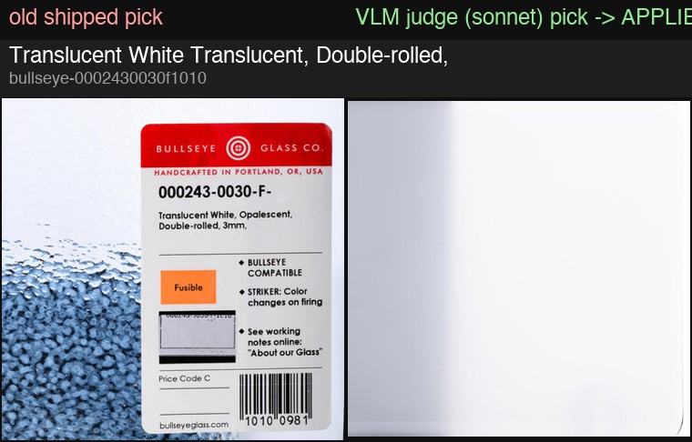

# VLM judge -- targeted pass on user-flagged products (2026-07-13)

Follow-up to the 41-product pilot (`vlm_judge_pilot.md`) while the full-corpus
decision is pending: a sonnet-only forced-choice judge pass over 5 flagged
products, with winning picks **applied to the committed registry**
(`scripts/vlm_judge_targeted.py`; judge machinery reused from
`scripts/vlm_pick_judge.py`, apply path per the `sweep_uncropped_bullseye.py`
precedent from PR #128). 5 judge calls, $0.26 total, zero parse failures.

## Per-product verdicts

| Product | Shipped | Judge | Verdict |
|---|---|---|---|
| Translucent White, Double-rolled 3 mm (`bullseye-0002430030f1010`) | #4 | #1 | **CHANGED & APPLIED** -- shipped pick was the product-label macro (the `_04.jpg` sticker close-up, heuristic score 0.9044: confidently wrong again); judge picked #1, the straight-on flat white sheet. Winner sits on a *black* studio ground with a left-edge band the white-background scrub can't see -- applied a new self-verifying **dark-edge trim** (crop `[46, 38, 1192, 1162]`, 89% area kept), generalizing report.md's bespoke dark-corner scrub exactly as that report requested ("flagging for a future pass to generalize") |
| Clear Transparent, Single-rolled 3 mm (`bullseye-0011010000f1010`) | #1 | NONE | **NONE, as predicted** -- the gallery has exactly one image (the perspective side view already shipped). Shipped pick left as-is; confirmed second-source (Delphi) case |
| Light Mineral Green Transparent Irid (`bullseye-0012470031f1010`) | #2 | #2 | **CONFIRMED** -- judge independently agrees with the shipped `_02` over the full-bleed macro `_01` the raw picker argmax preferred, validating the sweep's kept-with-reasoning decision |
| White Opalescent, Thin-rolled 2 mm (`bullseye-0001130050f1010`) | #1 | #1 | **CONFIRMED** -- white-glass detector blind spot does not translate into a wrong pick here |
| Translucent White, Thin-rolled 2 mm (`bullseye-0002430050f1010`) | #1 | #1 | **CONFIRMED** -- ditto (its gallery also contains the label macro at #4; the judge did not fall for it) |

Summary: 1 changed, 3 confirmed, 1 NONE. No registry row was touched except
the one changed product (its row gets `pick_score: null` + a `vlm_judge`
provenance marker, same posture as the existing manual-override rows).

## Board

Old shipped pick vs. applied judge pick, for the changed product:

## Notes for the corpus decision

- Another "confidently wrong" heuristic pick (0.9044) fixed by the judge --
  consistent with the pilot's core finding that pick_score cannot gate the
  judge.
- The judged NONE on Clear Single-rolled behaves exactly as the pilot's
  NONE-rate analysis expects: a true no-usable-candidate gallery, actionable
  only by a second scrape source.
- The dark-edge trim (`_dark_edge_trim` in `scripts/vlm_judge_targeted.py`)
  is a candidate for merging into the main picker crop path if more
  black-ground photos turn up corpus-wide.
- Image bytes: `catalog_images/` is gitignored; the main checkout will fetch
  the new winner automatically on its next `build_swatch_library.py` run
  (Phase C force-refetches when the registry URL differs from disk).
- **KNOWN CHURN-BACK RISK (action needed before the next full rebuild):**
  measured with the current picker, this product's gallery still scores the
  label macro highest (#4 at 0.907 vs the judge's #1 at 0.603 -- the label
  card reads as a clean full-bleed "sheet" to every pixel component). The
  build's stability rule replaces a shipped image when the new argmax beats
  it by >0.15; 0.907-0.603 = 0.30, so an unguarded rebuild **will revert
  this row to the label macro**. The build script is not modified here (it
  was under a concurrent-edit freeze when this pass ran); the fix is a
  one-line guard in `build_swatch_library.py` -- skip the argmax/stability
  replacement for rows carrying the `vlm_judge` provenance marker, same
  spirit as its existing `WHITE_ON_WHITE_OVERRIDE`/`REACTIVE_CLOUD` manual
  lists. Until that lands, treat `vlm_judge`-marked rows as manual overrides.
