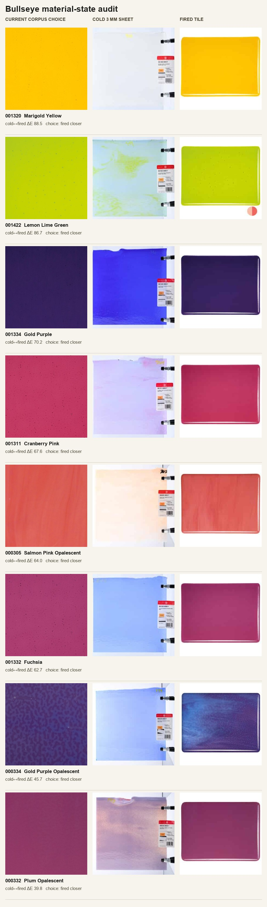

# 032 — A clean image can still be the wrong glass: cold/fired material-state audit

Date: 2026-07-10. Branch `codex/delighting-data-quality-bet` (off
`origin/research/delighting` at report 031). Code:
`corpus/cold_state_audit.py`, `corpus/cold_state_reground.py`. Artifacts:
`results/cold_state_audit_032/{summary.json,material_state_manifest.json,
material_state_contact_sheet.jpg,regrounding.json}`.

This report deliberately steps back from the extractor and renderer. Reports 019 and 021 did
important work on **image purity**: remove merchandise, reaction-test photos, front-lit suspects,
and hash duplicates. The question here is different:

> Even when a photo is clean, correctly named, and genuinely depicts glass, is it the physical
> state of the sheet that a stained-glass artist is buying and placing in Vitrai?

For Bullseye striker glass, the answer is often no. The current corpus overwhelmingly selects the
**fired color** that Bullseye markets to kilnformers, while Vitrai's stained-glass sheet workflow
normally needs the **cold, unfired sheet**. That distinction was invisible to the previous
contamination taxonomy because both images are legitimate glass photography.

---

## 0. TL;DR

### Finding A — 26/27 current choices follow the fired state, not the cold sheet

Bullseye publishes an unusually valuable labeled archive in its official “About Our Glass” pages:
figures captioned **Unfired Sheet**, **Fired Tile**, and nominal gauge (`-0030` = 3 mm,
`-0050` = 2 mm), plus an explicit **Striker** flag. I joined those pages to Bullseye's live store
gallery and Vitrai's canonical clean manifest.

For the 27 striker formulas with a complete evaluable triple:

| result | count |
|---|---:|
| current first store image closer to labeled **fired tile** | **26 / 27 (96.3%)** |
| current first store image closer to labeled cold sheet | 0 / 27 |
| ambiguous | 1 / 27 |
| median cold ↔ fired color difference | **24.4 ΔE76** |
| formulas above 20 ΔE | **20 / 27** |
| formulas above 40 ΔE | **7 / 27** |
| maximum | **88.5 ΔE** |

The one ambiguous case is Lacy White (`000143`), whose labeled cold and fired appearances differ
by only 0.36 ΔE under this probe. It is not a contradictory example; it is a non-changing glass.

Within the canonical clean manifest, the complete-triple test proves **48 rows across 24 formulas**
currently carry a fired-leaning choice. This is a strict lower bound, not the full affected set:
the clean corpus contains **117 rows across 58 striker formulas**, and official cold anchors exist
for **111 rows across 53 of those formulas**.

### Finding B — the existing source already contains a better cold-state corpus

The technical archive exposes:

- 239 formula pages;
- 146 formulas with an official cold-sheet image;
- 110 formulas with a labeled fired image;
- 62 formulas explicitly marked Striker;
- 146 nominal 2 mm + 3 mm cold-sheet pairs.

Against Vitrai's clean Bullseye subset, official cold anchors cover **266 of 509 rows across 142 of
250 formulas**. This is not a request for a new scrape from a dubious source. It is structured,
manufacturer-labeled data that the current scraper did not know existed.

### Finding C — nominal thickness pairs contain real physics, but only after duplicate rejection

The 2 mm/3 mm pairs looked like ideal Beer–Lambert supervision. Naively, they are not:
**93 of 143 decoded pairs are exact image duplicates**. The same photograph is labeled as both
gauges, so a model trained on all pairs would learn the physically false rule “thickness changes
nothing.”

The remaining 50 distinct-image pairs are much more interesting. After normalizing each image by
its own white surround:

| distinct cold pairs only | n | Beer–Lambert beats copying 2 mm | median OD ratio 3 mm / 2 mm | physical expectation |
|---|---:|---:|---:|---:|
| all categories | 50 | **36 / 50 (72%)** | **1.376** | 1.5 |
| Cathedral | 10 | **8 / 10 (80%)** | **1.448** | 1.5 |
| Opalescent | 25 | 18 / 25 (72%) | 1.367 | 1.5 |
| Wispy/Streaky | 15 | 10 / 15 (67%) | 1.342 | 1.5 |

This is not radiometric ground truth—the median absorption-coefficient disagreement is still
0.354 relative—but it is meaningful **weak physical supervision**, especially for Cathedral.
The correct conclusion is neither “use all 146 pairs” nor “catalog RGB is useless.” It is:
**hash/decoded-image gate first, then use the distinct pairs as a monotonic optical-density prior.**

### Finding D — report 021's class-level color conclusion survives, but aggregation hid the bug

I re-ran report 021's exact sampling, exclusions, center crop, Lab conversion, and FFT statistic on
the current clean corpus, then replaced only the image source with official cold anchors.

- Proven-fired scope: 27 sampled rows / 22 formulas replaced; paired median shift **36.2 ΔE**.
- All-labeled-striker scope: 60 sampled rows / 49 formulas replaced; paired median shift
  **30.6 ΔE**.

Yet cathedral's class median chroma moves only **31.0 → 29.0** in the broad correction. The main
team's target of C≈28.7 therefore remains good—if anything, the cold correction supports it.
This is the important data lesson: a broad class distribution can look stable while individual
products are spectacularly wrong.

The cathedral high-frequency median moves **0.0353 → 0.0292** (−17%). That is partly a state
change and partly a framing/scale change: the current input is often a close crop of a fired tile,
whereas the cold reference shows a whole clamped sheet. Therefore report 021/022's texture-energy
grounding is useful, but it is not yet cleanly separated from photographic magnification.

---

## 1. Why the product target changes the definition of “ground truth”

Bullseye formulates many fusible colors for their post-kiln appearance. Its own guidance says
striker glasses can be pale, milky, or completely different in their cold form and develop their
target color through heatwork. It explicitly distinguishes the needs of kilnformers from stained-
glass and mosaic artists. See Bullseye's [Understanding Striker Glasses](https://shop.bullseyeglass.com/pages/understanding-striker-glasses)
and [What to Expect from Bullseye Glass](https://www.bullseyeglass.com/what-to-expect-from-bullseye-glass/).

That distinction maps directly onto Vitrai:

- The right-hand sheet panel represents a sheet as an artist owns, inspects, marks, and cuts it.
- The left-hand panel previews pieces assembled from that sheet.
- Unless the artist explicitly pre-fires a striker, both views should start from the cold material.

The current first-image rule is not selecting random junk in these cases. It is selecting a highly
produced, color-rich, legitimate image optimized for a neighboring product audience: kilnforming.
That is why a conventional purity audit cannot catch it. The ontology is wrong, not the pixels.

Fuchsia (`001332`) is the clearest example. The current corpus image is saturated magenta. The
official cold 3 mm sheet is pale blue and its label says “STRIKER: Color changes on firing.” The
official fired tile is magenta. All three images are “real Fuchsia glass,” but only one answers
Vitrai's default stained-glass question.



The contact sheet is intentionally not color-corrected. It shows the source data as published.
Rows include Marigold Yellow, Lemon Lime Green, Gold Purple, Cranberry Pink, Salmon Pink,
Fuchsia, Gold Purple Opalescent, and Plum Opalescent. In every shown case the current corpus choice
visually tracks the fired tile and can be dramatically unlike the cold sheet.

---

## 2. Sources and join

### 2.1 Live store catalog

`cold_state_audit.py` reads Bullseye's public Shopify JSON, using the same source family as
`scripts/build_swatch_library.py`:

- 2,974 total products at audit time;
- 633 products matching Vitrai's fusible sheet-SKU rule;
- 623/633 sheet products have multiple gallery images;
- 144 sheet products belong to Bullseye's official Strikers collection;
- those 144 products collapse to 60 color formulas because 2 mm/3 mm and size products repeat.

The first-image scraper reduces an information-rich gallery to one unlabeled image before any
downstream research sees it. Report 019 correctly diagnosed one consequence (reaction demos lead
the gallery). This report finds a second: gallery order also encodes **process state**.

### 2.2 “About Our Glass” technical archive

Bullseye's WordPress API exposes the content behind pages such as
[001332 Fuchsia](https://www.bullseyeglass.com/001332-fuchsia/). The HTML is unusually structured:

- a `Striker` heading and explanation;
- a `Cold Characteristics` section;
- figures captioned `001332-0030 Unfired Sheet` and `001332-0050 Unfired Sheet`;
- a `Working Notes` section;
- a figure captioned `001332-0030 Fired Tile`;
- chemistry/reactivity notes and process guidance.

The audit parses figure captions and section context rather than guessing from filenames alone.
The resulting `cold_anchor_rows` in `material_state_manifest.json` preserve formula, gauge,
material state, technical page, source URL, cold-characteristics text, category, and every clean
manifest row the anchor could replace.

### 2.3 Vitrai joins

The join key is the six-digit Bullseye color formula, not a product title or RGB similarity.
Examples:

- `001332-0030-F-1010` → formula `001332`, gauge 3 mm;
- `001332-0050-F-HALF` → formula `001332`, gauge 2 mm;
- clean-manifest id `bullseye-0013320030f1010` → the same formula and gauge.

This is important because Vitrai's current formula deduplication deliberately collapses size
variants, while the material-state audit needs to retain gauge and process state as separate axes.

---

## 3. Material-state classification experiment

### 3.1 Triple construction

For each official striker formula, the script requests:

1. the store product's first gallery image—the image Vitrai's current scraper chooses;
2. the technical page's labeled 3 mm cold sheet;
3. the technical page's labeled 3 mm fired tile.

Twenty-seven formulas have all three and valid downloads. Six additional technical formulas have
a cold/fired pair but no matching current store triple under the sheet-product rules.

### 3.2 Metric

Each image is center-cropped to avoid the cold sheet's clamps/label and the fired tile's white
surround. A robust median sRGB color is converted to CIE Lab. The first store image is classified
as fired-closer if:

`ΔE(store, cold) − ΔE(store, fired) ≥ 4`.

The symmetric rule identifies cold-closer; a margin under 4 is ambiguous. The four-ΔE margin is an
audit heuristic chosen to ignore small JPEG/exposure differences. It is not a material classifier
for arbitrary photos.

### 3.3 Result

The 26/27 fired-closer result is stronger than a statistical tendency. It reveals the store's
presentation convention. The current first image is typically an interior/texture presentation of
the fired tile; the technical cold image is often a full sheet with clamps and a product label.

The paired cold/fired differences are large:

| percentile / threshold | ΔE or count |
|---|---:|
| median | 24.43 |
| p75 | 42.77 |
| p90 | 68.66 |
| maximum | 88.53 |
| ≥10 ΔE | 24 / 27 |
| ≥20 ΔE | 20 / 27 |
| ≥40 ΔE | 7 / 27 |

For context, these are not the subtle color-balance shifts delighting normally tries to remove.
They include hue-family changes such as blue cold glass becoming magenta/purple after firing.

### 3.4 Lower bound versus correction coverage

Three counts must not be conflated:

| meaning | formulas | clean rows |
|---|---:|---:|
| clean Bullseye corpus total | 250 | 509 |
| belongs to store Strikers collection | 58 | 117 |
| official cold anchor exists and technical page says Striker | 53 | 111 |
| complete triple proves current choice is fired-closer | 24 | 48 |

The 48 rows are the **proven error lower bound**. The 111 rows are the **cold-correction
opportunity**. It would be unjustified to call all 111 current images fired without the complete
triple; it would be equally unjustified to ignore the official cold anchor merely because a fired
comparison is absent.

---

## 4. The thickness-pair bet

### 4.1 Why this was worth trying

If the same glass formula is photographed cold at 2 mm and 3 mm, Beer–Lambert absorption predicts

`OD(3 mm) / OD(2 mm) = 3/2`, where `OD = -log(T)`.

That relation could provide a real-physics constraint without a spectrophotometer. It is exactly
the kind of high-risk data bet this track should test: use nominal manufacturing metadata to turn
ordinary catalog images into weak inverse-rendering supervision.

### 4.2 White-reference normalization

The official cold-sheet photos usually show the sheet on a bright white field. The probe:

1. takes a fixed left-center crop that avoids clamps and the product label;
2. uses the image-wide 99.5th RGB percentile as a per-channel white reference;
3. decodes sRGB to linear light;
4. estimates `T = sheet / white`;
5. predicts `T_3 = T_2^(3/2)`;
6. compares that prediction against the actual 3 mm crop and against a null that simply copies
   the 2 mm estimate unchanged.

This does not estimate the camera response curve, polarization, reflection, or scatter. The gate
is intentionally modest: does thickness-aware absorption predict the second catalog photo better
than pretending thickness has no effect?

### 4.3 The duplicate trap

Of 144 clean-corpus candidate formula pairs, 143 downloaded successfully. **Ninety-three are
decoded exact duplicates.** Different 2 mm and 3 mm captions point to identical pixels.

This explains why an unfiltered aggregate reports a median optical-depth ratio of exactly 1.0 and
a zero “copy 2 mm” error. That result is a publishing/data-reuse artifact, not glass physics.

It also sharpens report 019/021's duplicate lesson. Hash deduplication is not only needed to avoid
train/validation leakage. Here it is a prerequisite for discovering the physical signal at all.

### 4.4 Distinct-pair result

After exact decoded-image rejection, 50 pairs remain. Beer–Lambert wins in 72%, and the median
optical-depth ratio is 1.376. Cathedral is the strongest subset: 8/10 wins and a median ratio of
1.448, only 3.5% below the ideal 1.5 ratio.

The result is surprisingly good given different physical sheets and uncalibrated photography, but
it is not accurate enough to call ground truth:

- all-distinct median absorption-coefficient relative disagreement: 0.354;
- Cathedral: 0.347;
- Opalescent: 0.345;
- Wispy/Streaky: 0.523.

The weaker wispy result is expected: heterogeneous color fields, registration mismatch, and
scatter violate the single homogeneous absorption model more strongly.

### 4.5 Appropriate use

Use these 50 pairs for losses such as:

- 3 mm should not be more transmissive than 2 mm after white normalization;
- optical-density direction in RGB should be broadly shared across gauges;
- Cathedral's median OD ratio should be near 1.5 with a robust loss;
- model predictions for 2 mm/3 mm should share a formula-level absorption latent.

Do **not** use them as aligned pixel pairs. They are different sheets, often differently framed,
and only share formula, gauge, and cold state.

---

## 5. Did this invalidate report 021's real-vs-synthetic grounding?

No. It exposed a different failure scale.

`cold_state_reground.py` reproduces report 021's appearance protocol:

- clean manifest, `confidence != low`;
- Youghiogheny dark-opaque excluded;
- deterministic seed 11;
- maximum 250 rows per class;
- 60% center crop resized to 200²;
- the same CIE Lab/LCh and radial-FFT functions imported directly from
  `appearance_stats.py`.

The current report-024-updated manifest yields 1,145 eligible rows and 692 sampled rows. Two
counterfactuals replace only the photo source:

1. **proven-fired choices** — formulas where the complete triple says the current choice is
   fired-closer;
2. **all labeled strikers** — every selected striker formula with an official cold anchor.

### 5.1 Class medians

| class / metric | current baseline | proven-fired corrected | all-striker cold corrected |
|---|---:|---:|---:|
| Cathedral L* p50 | 61.57 | 62.15 | **63.36** |
| Cathedral C* p50 | 31.00 | 30.17 | **28.97** |
| Cathedral hue mean | 42.77° | 42.13° | **49.38°** |
| Cathedral hf p50 | 0.03535 | 0.03396 | **0.02923** |
| Opalescent L* p50 | 62.32 | 63.30 | **63.48** |
| Opalescent C* p50 | 31.84 | 31.68 | **31.42** |
| Opalescent hue mean | 85.27° | 88.46° | **89.22°** |
| Opalescent hf p50 | 0.02069 | 0.02020 | **0.01979** |
| Wispy L* p50 | 56.84 | 57.25 | **57.25** |
| Wispy C* p50 | 28.51 | 28.69 | **29.55** |
| Wispy hue mean | 63.86° | 64.07° | **63.83°** |
| Wispy hf p50 | 0.01664 | 0.01664 | **0.01671** |

Report 021 tuned cathedral recipes toward C≈28.7. The broad cold correction lands at C=28.97.
That conclusion survives almost perfectly. There is no reason to undo the main team's cathedral
desaturation work based on this audit.

### 5.2 Why the bug still matters enormously

The aggregate is stable because 60 changed rows are diluted across 692 sampled images and because
some striker shifts cancel in broad color space. Paired rows tell the actual product story:

| correction scope | sampled rows | sampled formulas | paired ΔE median | p90 | max |
|---|---:|---:|---:|---:|---:|
| proven fired | 27 | 22 | **36.2** | 76.0 | 98.2 |
| all labeled strikers | 60 | 49 | **30.6** | 72.6 | 98.2 |

An artist selecting Fuchsia does not care that the corpus-wide median remained stable after
Fuchsia moved from blue to magenta. Class-level realism and SKU-level correctness are different
metrics. Vitrai needs both.

### 5.3 Texture-statistic caution

Cathedral hf p50 falls 17% in the broad correction. It would be tempting to conclude that cold
glass has less fine texture than fired glass. The data does not isolate that claim. Current images
are often close crops of a fired tile; cold references show a larger sheet area. A bubble or ripple
therefore occupies fewer pixels even if its physical size is unchanged.

This means future texture grounding needs a **physical spatial-frequency axis** (cycles per inch or
millimeter), not only cycles per image. Vitrai already stores nominal sheet dimensions and the
technical pages provide gauge. The missing ingredient is a trustworthy crop-to-physical-scale
calibration per source image.

---

## 6. Proposed data representation

The current clean manifest answers “is this a usable photo associated with this SKU?” The inverse-
rendering program needs a richer record:

```json
{
  "formula": "001332",
  "gauge_mm": 3.0,
  "material_state": "cold_unfired",
  "capture_role": "whole_sheet_backlit_reference",
  "appearance_role": "stained_glass_default",
  "source_label": "001332-0030 Unfired Sheet",
  "source_confidence": "manufacturer_explicit",
  "same_physical_sheet_group": null,
  "decoded_content_hash": "...",
  "paired_formula_group": "bullseye-001332",
  "process_notes": "Striker; color develops on firing"
}
```

The fired tile is not deleted. It gets a separate record:

```json
{
  "formula": "001332",
  "gauge_mm": 3.0,
  "material_state": "fired",
  "capture_role": "fused_test_tile",
  "appearance_role": "kilnformed_reference"
}
```

This separation preserves potentially valuable process data without letting the fired target leak
into cold-sheet transmittance learning or Vitrai's default material preview.

Minimum fields for every future source:

1. **What physical state?** cold, fired, annealed, coated/iridized, unknown.
2. **What lighting role?** transmitted/backlit, reflected/front-lit, mixed, unknown.
3. **What object role?** whole sheet, close crop, fired tile, reaction test, finished panel.
4. **What gauge?** nominal thickness and confidence.
5. **What pairing is real?** same pixels, same physical sheet, same formula only, or merely same
   named category.

The final field is crucial. “Pair” is not one thing.

---

## 7. Recommended research use

### 7.1 Immediate: make a cold-state shadow corpus

Do not overwrite the existing canonical manifest in place. Generate a derived
`cold_material_manifest.json` whose Bullseye rows prefer official cold anchors when the technical
label is explicit. Preserve the old source and attach a role transition. Then run all material-
property experiments against the shadow manifest and compare.

The audit already emits the 142-formula / 266-row `cold_anchor_rows` join needed to build it.

### 7.2 Training: separate state supervision from appearance augmentation

- Cold images supervise the material that Vitrai previews by default.
- Fired images can supervise an optional heatwork/process model, never the same target tensor.
- The 50 distinct thickness pairs contribute a robust formula-level optical-density loss.
- The 93 exact duplicate pairs contribute nothing physical and must be excluded before splitting.
- Train/validation splits must be grouped by formula **and** decoded content hash.

### 7.3 Evaluation: add SKU correctness beside class realism

The existing distributional metrics ask whether generated recipes cover realistic classes. Add a
state-aware metric:

- for each labeled striker formula, compare predicted cold appearance against the official cold
  anchor, never against the fired store thumbnail;
- report per-formula errors and their median/p90, not only a pooled class median;
- retain a small visually inspected list of dramatic hue-changing strikers as a regression set.

Suggested first regression formulas from the contact sheet: `001320`, `001422`, `001334`,
`001311`, `000305`, `001332`, `000334`, `000332`.

### 7.4 Product-facing implication

For catalog-backed sheets in the right-hand panel, a striker formula should show the cold anchor
by default. A future explicit “after firing” mode could show the fired tile, but silently choosing
the fired marketing color makes the sheet inventory and assembled preview wrong for ordinary cold
stained-glass construction.

This is not a UI proposal; it is the target definition the rendering research must honor.

---

## 8. What not to do

1. **Do not globally switch from gallery position 1 to position 3.** Fuchsia happens to use `_03`
   for the cold sheet, but position conventions are not a semantic contract across every product.
   Use the technical-page caption/section label.
2. **Do not call every striker row proven-wrong.** We proved 48 clean rows with complete triples;
   111 have official cold alternatives. Keep confidence levels separate.
3. **Do not train on all nominal 2 mm/3 mm pairs.** Sixty-five percent of evaluated pairs are exact
   duplicate pixels and encode a false no-thickness relation.
4. **Do not use the 50 distinct pairs as aligned texture supervision.** They are different sheets.
   Their value is formula-level absorption behavior.
5. **Do not interpret raw manufacturer RGB as spectral transmittance.** White normalization recovers
   a useful weak trend, not a calibrated camera or illuminant.
6. **Do not undo report 022's cathedral desaturation.** The cold-state correction supports its
   C≈28.7 target.
7. **Do not use image-space FFT alone as physical texture scale.** The fired/cold source change also
   changes crop magnification.

---

## 9. New research bets opened by this audit

### Bet 1 — Formula-conditioned optical-density latent

Train an encoder to predict a formula-level absorption coefficient shared by 2 mm and 3 mm cold
images. Render transmittance as `exp(-alpha * thickness)`, while a separate spatial residual models
sheet-to-sheet body variation. Supervise with the 50 distinct real pairs plus synthetic exact pairs.

**One-week gate:** on held-out distinct Cathedral formulas, thickness-aware prediction must beat the
copy-2mm baseline more often than the raw catalog heuristic's 8/10 and reduce median OD-ratio error
below `|1.448 - 1.5|` after robust calibration. If it cannot beat the simple source statistic, the
network adds no value.

### Bet 2 — Process-state disentanglement

Use cold/fired formula pairs as weak semantic supervision for a latent split:

`material identity + process state -> appearance`.

The immediate purpose is not to simulate kilns. It is to force the material encoder to represent
“same formula, radically different observed RGB because state changed” instead of memorizing one
catalog color. That prior may make the encoder more skeptical of nuisance RGB in arbitrary uploads.

**Gate:** nearest-neighbor retrieval in material-identity latent space should pair cold and fired
views of the same held-out formula despite 20–80 ΔE appearance shifts, while a state head correctly
separates cold/fired.

### Bet 3 — Screen-coded real capture benchmark

The catalog can provide weak formula/gauge/state labels but not pixel-aligned `T`, relief, or
background flow. The next qualitatively different data source should be a tiny controlled capture:
place real sheets over a calibrated emissive screen displaying flat white, RGB primaries, a
pseudorandom dot field, and shifted patterns. One short phone video gives known backgrounds and
same-sheet alignment, allowing direct recovery of color transmission and refractive displacement.

This is higher value than scraping another thousand unlabeled beauty shots because it supplies the
missing causal variation. The catalog audit tells us which formulas/states/gauges to buy for maximum
coverage.

---

## 10. Verdict

**PURSUE.** Data quality is now the highest-leverage blocker, but “quality” must mean more than
purity and deduplication.

The main team's canonical clean corpus remains valuable for variety, appearance coverage, and real-
photo grounding. This audit does not replace that work. It adds a missing axis: **physical material
state**. On striker glass, that axis changes individual products by a median 30–36 ΔE even while
class-wide medians barely move.

The most useful fresh result is the combination:

1. official cold anchors cover 111/117 clean striker rows;
2. 26/27 complete triples show the current first-image convention follows fired color;
3. 93/143 nominal thickness pairs are fake duplicates;
4. after rejecting them, the remaining real pairs recover a near-physical thickness signal,
   especially Cathedral's 1.448 median OD ratio versus 1.5 expected;
5. report 021's cathedral chroma target survives, while SKU correctness and physical texture scale
   clearly do not.

So the next data representation should not be “one cleaned RGB image per SKU.” It should be a
**state-aware, gauge-aware set of evidence with explicit pairing semantics**. That is a materially
better foundation for inverse rendering—and it is already hiding in the manufacturer's own data.

---

## Reproduction

From `research/delighting` in a checkout that can read the ignored catalog assets:

```bash
python3 corpus/cold_state_audit.py \
  --registry /path/to/frontend/public/assets/glass_swatch_registry.json

python3 corpus/cold_state_reground.py \
  --catalog-dir /path/to/frontend/public/assets/catalog_images
```

The first command reads the live official APIs, writes the joined material-state/thickness
manifest and contact sheet, and prints `summary.json`. The second uses those anchors to reproduce
the report-021 appearance protocol and writes `regrounding.json`.

One technical cold image (`002176-0030_cold.jpeg`) returned HTTP 404 during the thickness pass; it
is recorded in `thickness_failures`. All 27 material-state triples succeeded.
