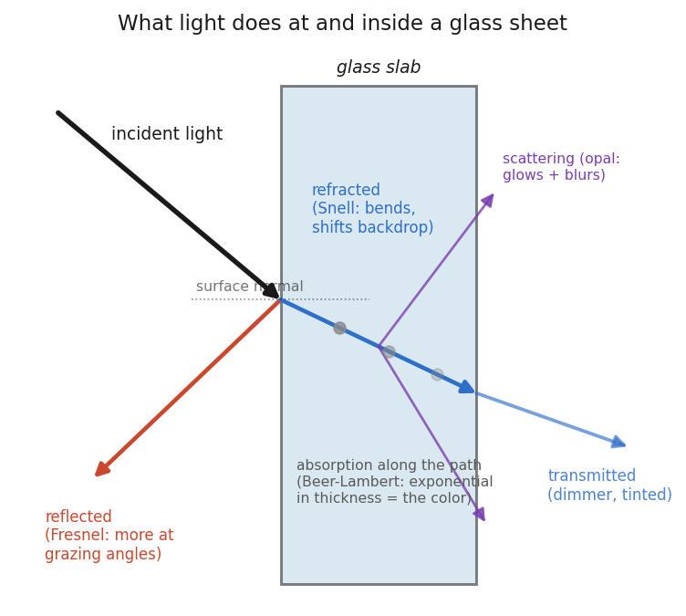
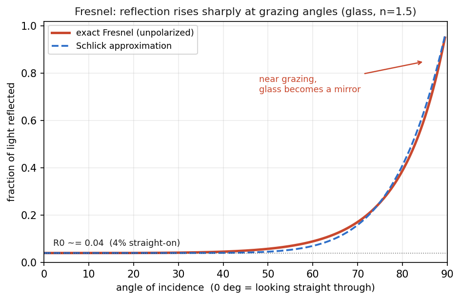

# Report 049 — Glass physics + rendering primer (path tracing vs. rasterizers)

*A self-contained primer for a technical reader with no optics or graphics background. We start from "what is light, for our purposes" and build every later idea on the one before it. Nothing is assumed; every term is introduced in plain language before it is used. Equations appear, but each is immediately translated into a sentence. Stained glass is the running example. A short appendix at the end maps our project's material maps onto the physics — but the primer stands on its own without it.*

**How to read this.** Sections 1–4 are the primer proper: (1) the physics of light at and inside glass, (2) path tracing — the "correct but slow" method, (3) why rasterizers find transparency hard and the ladder of tricks they use, and (4) what shipping AAA engines actually do. The appendix (5) is one page, optional, and specific to our lab.

---

## 0. Light, for our purposes

Forget most of physics. For rendering glass you only need one mental model of light, and it is deliberately crude.

**Light travels in straight lines called rays, and each ray carries energy.** A ray leaves a source (the sun, a lamp, a bright window), travels in a straight line until it hits something, interacts, and continues as one or more new rays. Your eye — or a camera — is just a bucket that some of those rays eventually fall into. The image you see is a map of "how much energy arrived, from each direction, at each point on the sensor."

Two properties of a ray matter to us:

- **How much energy it carries in a given direction.** Graphics people have a precise word for this: **radiance**. Radiance is "brightness along a ray" — the amount of light energy flowing per second, through a tiny area, into a tiny cone of directions. When we say a pixel is bright, we mean a lot of radiance arrived along the ray that maps to that pixel. Every rendering method, however fancy, is ultimately computing one number per pixel (per color): the radiance arriving there. Keep that in mind — it is the thing all these algorithms are competing to estimate.

- **Its color.** Physically, light is a mix of wavelengths, and wavelength is what your eye reads as color (short = blue, long = red). We almost always cheat and track just three numbers per ray — red, green, blue — instead of a full spectrum. This cheat is good enough for almost everything, and it fails in exactly one place we will name later (dispersion — the prism effect).

That is the whole model: **straight rays, each carrying an amount of energy (radiance) in three colors.** We ignore light's wave nature, polarization, and quantum behavior. They rarely change the picture, and where they do (dispersion) we will flag it.

The entire subject of "rendering glass" is now just one question asked over and over: **when a ray meets glass, what comes out, and in which directions?** Answer that, and both the physics and every rendering trick fall out of it.

---

## 1. What light does at and inside glass

Glass is interesting because, unlike a brick wall, it does something at its *surface* **and** something in its *interior*. Four things can happen to a ray that arrives at a sheet of glass, and a real image of stained glass is the sum of all four (Figure 1):

1. **Reflection** at the front surface — some light bounces off, like off a pond.
2. **Refraction** — the rest enters the glass but bends as it crosses the surface, shifting and distorting whatever is behind.
3. **Absorption** inside the glass — as the ray travels through the material, some of its energy is soaked up, more for some colors than others. This is where a stained-glass sheet's *color* comes from.
4. **Scattering** inside the glass — in milky/opal glass, tiny particles knock the ray sideways, spreading it out. This is why opal glass glows and blurs whatever is behind it.

*Figure 1 — the four fates of a ray at a glass sheet. Everything in this primer is bookkeeping on this one diagram.*

Let us take them one at a time.

### 1.1 At the surface: why anything reflects at all

Glass is optically *denser* than air. The single number that captures this is the **index of refraction** (IOR, symbol *n*): roughly, how much light slows down inside the material. Air is *n* ≈ 1.0; window glass is *n* ≈ 1.5; water is 1.33; diamond is 2.4. Whenever a ray crosses a boundary where *n* changes, two things happen at once: part of the light **reflects** back, and part **transmits** through (bending as it goes — see 1.3). The bigger the jump in *n*, the more reflects. That air-to-glass jump is the reason a window is faintly mirror-like even though you can see straight through it.

### 1.2 Fresnel: why glass mirrors more at a grazing angle

Here is the first genuinely important fact, and it is one everyone has seen without naming. **The fraction of light that reflects depends strongly on the angle you view the surface from.** Look straight through a window and it barely reflects — about 4% — and you see the scene behind. Look along the glass at a shallow, grazing angle and it becomes a near-perfect mirror. A wet road at night, a lake at sunset, the side of a glass building: all the same effect.

The rule that gives the exact reflected fraction as a function of angle is called the **Fresnel equations** (named after Augustin-Jean Fresnel; pronounced "fre-NEL"). The full equations are a bit ugly, but their *shape* is everything (Figure 2): the reflected fraction is low and nearly flat for most angles, then swings up toward 100% as the angle approaches grazing (90° from straight-on).

*Figure 2 — the Fresnel curve for glass. The dashed line is Schlick's cheap approximation, which real-time engines use instead of the exact equations.*

The value at straight-on (0°) has a name, **R₀** ("R-zero"), and a simple formula:

> **R₀ = ((n₁ − n₂) / (n₁ + n₂))²**
>
> *In words:* the straight-on reflectance is set by how big the jump in refractive index is between the two media. For air (1.0) meeting glass (1.5) this works out to about 0.04 — **4% reflects straight on.**

Because the exact Fresnel equations are expensive to evaluate millions of times per frame, real-time graphics uses a famous cheap stand-in, **Schlick's approximation**:

> **R(θ) ≈ R₀ + (1 − R₀)(1 − cos θ)⁵**
>
> *In words:* start from the straight-on value R₀, and as the angle gets more grazing (cos θ heading toward 0), push the reflectance up toward 1 with a fifth-power curve. It is nearly indistinguishable from the real thing (Figure 2, dashed) and costs almost nothing.

**Why this matters for stained glass:** the bright, mirror-like sheen you catch on a cathedral window from an angle — the reflection of the sky or the room — is the Fresnel term. Straight-on and backlit, it is only ~4% and easy to miss; from the side it dominates. Any rendering that leaves it out will make glass look like tinted plastic or a flat colored decal. Hold that thought — it is exactly the complaint our CTO had, and section 5 returns to it.

### 1.3 Refraction (Snell's law): why things shift and distort behind glass

The light that *doesn't* reflect crosses into the glass — and bends as it does. This bending is **refraction**, and the amount is given by **Snell's law**:

> **n₁ · sin θ₁ = n₂ · sin θ₂**
>
> *In words:* the ray's angle to the surface changes when it enters a denser medium — going into glass it bends *toward* the perpendicular; coming back out into air it bends the same amount the other way. The bigger the index jump, the sharper the bend.

For a sheet of glass with two parallel, perfectly flat faces, the bend on the way in is undone on the way out, so straight-on you see almost no distortion — just a tiny sideways shift. But the moment the surface is **not flat** — hammered, seedy, rippled, "cathedral" texture, hand-rolled relief — the two faces are no longer parallel, the bends no longer cancel, and every bump acts as a little lens. The background behind the glass gets **displaced, magnified, wobbled, and broken up**. This relief-driven distortion is a huge part of what makes textured glass *read* as real glass rather than a colored film. It is also, as we will see, one of the hardest things for cheap renderers to fake, because it depends on the actual 3-D shape of the surface, not just its color.

### 1.4 Absorption (Beer–Lambert): why thicker and darker glass is dimmer — and colored

Now the interior. As the transmitted ray travels *through* the glass, the material absorbs some of its energy. Crucially, **it absorbs different colors by different amounts** — that is the entire origin of stained glass color. "Ruby" glass strongly absorbs green and blue, letting red through; "cobalt" absorbs red and green, passing blue. The glass isn't adding red light; it is *subtracting everything but* red.

The law governing how much survives is **Beer–Lambert**:

> **T = e^(−σ·d)**  (equivalently **T = T_base^(thickness)**)
>
> *In words:* the fraction of light that makes it through — the **transmittance T** — falls off *exponentially* with the distance the ray travels inside the glass. σ ("sigma") is the absorption strength (per color); *d* is the path length through the glass.

Two consequences worth internalizing, because "exponential" is doing real work here:

- **Thickness matters, non-linearly.** Double the thickness and you don't halve the light — you *square* the surviving fraction. Glass that passes 50% at one thickness passes 25% at double, 12.5% at triple. This is why the thick base of a rolled sheet, or a lens of glass in a Tiffany fold, goes dramatically darker and more saturated than the thin parts — and why looking through glass edge-on (a long path) can be nearly opaque while looking through the face (a short path) is bright.
- **Darker = same mechanism, bigger σ.** A "dark ruby" sheet and a "pale ruby" sheet can be the same material with different amounts of colorant; the dark one just has a larger σ, so the exponential bites harder.

This one exponential is the workhorse of stained-glass appearance under backlight. When you hold a sheet up to a bright window, the color you see *is* the light source multiplied by e^(−σd), color by color.

### 1.5 Scattering: why opal/milky glass glows and blurs

Absorption removes energy from the ray. **Scattering redirects it.** Opal, opalescent, and milky glasses are full of microscopic particles or bubbles with a different index of refraction from the surrounding glass. Every one is a tiny surface that reflects and refracts, so a ray entering such glass gets knocked off course, possibly many times, before it leaves. The symbol for scattering strength is **σ_s** ("sigma-s", the *scattering* coefficient, as opposed to σ_a for absorption).

Two visible effects come out of scattering, and they are the signature of opal glass:

- **Blur.** Because a ray that entered heading toward point A can leave heading toward point B, the sheet no longer transmits a sharp image of what's behind it. It transmits a *blurred* version. Strong scattering = strong blur; you can make out a bright window behind milky glass but not its mullions.
- **Glow.** Scattered light emerges spread over a range of directions, so the sheet looks self-luminous — it "glows" evenly rather than showing a crisp hotspot where the light source is. A clear ruby sheet shows you the bright bulb behind it; an opal ruby sheet turns that bulb into a soft, all-over rosy glow.

Physically this is the same family of effect as skin, wax, marble, and milk — light entering a translucent body, bouncing around inside, and leaving somewhere else. Graphics calls the general phenomenon **subsurface scattering**. For a thin glass sheet it shows up as a controllable blur-plus-glow of the backdrop, which is a convenient thing to remember because, as section 3 shows, that is *exactly* how cheap renderers fake it — with a blur.

### 1.6 Dispersion and caustics, briefly

Two more real effects, mentioned so you recognize them, though they are second-order for flat stained glass:

- **Dispersion** — the refractive index *n* is slightly different for different colors (blue bends a touch more than red). Send white light through a prism and the colors fan out; that is dispersion. This is the one place our "just track R, G, B" cheat is physically wrong, because it assumes all colors bend identically. For stained glass it matters only at sharp bevels and cut edges, where you get little rainbow fringes. Most renderers ignore it and are right to.

- **Caustics** — when curved or textured glass **focuses** transmitted light, it concentrates many rays onto small bright patches on whatever is beyond. The rippling bright net at the bottom of a swimming pool is a caustic; so is the bright curl of light a wine glass throws on a tablecloth. Caustics are *transmitted* light that has been bent and bunched by refraction. They are beautiful, they are physically just "refraction plus focusing," and — as the next section explains — they are notoriously the single hardest thing for a renderer to compute.

**Summary of Section 1.** A glass sheet takes each incoming ray and splits it: a Fresnel fraction reflects (more at grazing angles), the rest refracts (bending, and distorting the backdrop if the surface has relief), travels through the interior losing color-selective energy to absorption (exponential in thickness — the source of color), and may be scattered into a blur-and-glow (opal glass). Reflection, refraction, absorption, scattering. Everything below is about how the two great families of renderers try to reproduce this split.

---

## 2. Path tracing: simulating light itself

### 2.1 The idea

**Path tracing** takes the physics of Section 1 completely literally. It doesn't fake anything; it simulates rays bouncing around a scene according to the actual rules, and lets the image emerge. It is the method Blender's **Cycles** renderer uses, and it is what we treat in this lab as **"truth"** — the reference every faster method is measured against.

The core idea is stated by the **rendering equation** (Kajiya, 1986). Do not be scared of it; here it is in words first:

> **The light leaving any point in any direction = the light that point emits itself + the sum, over every direction it could receive light from, of (incoming light) × (how much of it the surface sends toward the viewer).**

That last factor — *"how much incoming light from direction A gets sent toward direction B"* — is the surface's optical fingerprint, and it has a name: the **BSDF** (Bidirectional Scattering Distribution Function). A BSDF is just a function that answers one question: *"light arrived from this direction; what fraction leaves in that direction?"* A mirror's BSDF says "all of it, in exactly one reflected direction." A flat wall's BSDF says "a little, spread equally over every outgoing direction." **Glass's BSDF encodes the whole of Section 1** — Fresnel reflection in one direction, refraction in another, absorption and scattering for what goes through. When you hear "BSDF," think: *the little rulebook at a surface that says where light goes.* (You may also hear BRDF — the *reflection*-only version — and BTDF — the *transmission* version; BSDF is the union of both.)

The rendering equation is *recursive*: the light arriving at point X came from other points Y, whose own outgoing light came from points Z, and so on. Light bounces. That recursion is what makes global illumination — color bleeding, soft shadows, glass tinting the wall behind it — happen for free. It is also why it is expensive.

### 2.2 Why it converges to the correct image

You cannot evaluate "the sum over every possible incoming direction" exactly — there are infinitely many. So path tracing uses **Monte Carlo integration**: instead of summing over all directions, it *samples* a few at random, follows those rays, and averages. Fire a ray from the camera through a pixel; when it hits a surface, consult the BSDF, randomly pick an outgoing (really incoming) direction to continue in, follow that, repeat until the ray hits a light or gives up. That single traced path gives one noisy guess for the pixel's radiance. Do it again with different random choices, and again — a **sample per pixel (spp)** each time — and **average**.

The mathematics of Monte Carlo guarantees that this average **converges to the exact answer** of the rendering equation as the number of samples grows. That is the profound and simple reason path tracing is "correct": it is an unbiased statistical estimate of the true physics. Give it enough samples and the error vanishes.

### 2.3 Why it is slow and noisy

The catch is in "enough samples." With few samples, the random choices haven't averaged out, and the image is grainy — that characteristic **noise** of an under-rendered path trace. Noise falls only as **1/√(samples)**: to halve the noise you need *four times* the rays; to halve it again, sixteen times. Getting from "grainy" to "clean" can mean hundreds or thousands of paths per pixel, each bouncing several times, each bounce evaluating a BSDF and testing the scene for the next hit. That is why a single Cycles frame can take seconds to minutes, and why real-time (60 frames/second) is a different world. Modern renderers lean hard on **denoisers** — smart filters (often AI) that clean the grain from a low-sample image — but denoising is a patch over the fundamental cost, not a repeal of it.

### 2.4 Why glass is a famously hard case

Glass punishes path tracing specifically, for reasons that follow directly from Section 1:

- **Many bounces.** A ray hitting glass usually *splits* — some reflects, some refracts — and each branch may hit more glass. A stack of panes, a bevel, a glass object seen through another: paths get long, and every extra bounce multiplies the work and the noise.

- **Caustics are the worst case.** Recall a caustic is a bright patch made by glass *focusing* light onto a surface. Path tracing starts rays at the *camera* and hopes they eventually wander to a light. But a caustic's brightness comes from a *very specific* set of ray paths — camera → diffuse surface → *just the right angle* through the glass → back to the light. Random sampling almost never stumbles onto that exact path, so caustics show up as sparse, extremely bright, slow-to-resolve **fireflies** of noise. Rendering clean caustics is the classic "path tracing is hard" example; whole specialized algorithms (photon mapping, bidirectional path tracing, Metropolis light transport) exist mainly to handle them.

- **Thin, sharp features.** Sharp refractive edges and thin films create high-contrast detail that needs many samples to resolve without noise.

So the trade is stark. Path tracing is **physically correct by construction** and needs *no special-casing* for glass — the same BSDF machinery handles a brick and a cathedral window. But it is **slow**, and glass is where it is slowest. That is precisely the gap the next two sections are about: how do you get a believable glass image *now*, in a game running at 60 fps, without simulating light?

---

## 3. Rasterization: fast pictures, and why glass fights back

### 3.1 What a rasterizer does — and doesn't

A **rasterizer** is the other great rendering family, and it is what every GPU is built to do at blistering speed. Its worldview is almost the opposite of path tracing. Instead of following light around a scene, it goes object by object: take a triangle, figure out which pixels it covers, and for each such pixel run a little program (a **shader**) that computes a color. Do that for every triangle. To handle occlusion — near things hiding far things — it keeps a **z-buffer** (depth buffer): for each pixel it remembers the depth of the closest surface seen so far and throws away anything farther. Fast, parallel, and the reason real-time 3-D exists.

Notice what a rasterizer fundamentally does **not** do:

- It shades **one surface per pixel** — the nearest opaque one. There is no notion of "and then the ray continued."
- **Rays do not bounce.** A shader knows about *its own* surface and whatever data you fed it up front. It does not, by default, know what is behind it, beside it, or reflected in it.
- It processes triangles in **whatever order they're submitted**, resolving depth per pixel afterward.

Every one of those is fine for an opaque brick. Every one of them is a problem for glass, because glass is *defined* by needing to know what is behind it, by bending it, and by not being the only surface along the ray.

### 3.2 Why transparency is genuinely awkward

Three concrete headaches:

1. **You need what's behind, but you shade one surface per pixel.** To tint the backdrop through a red window, the shader must *have* the backdrop's color. But the whole design shades the nearest surface and moves on.

2. **Sorting.** To blend a transparent surface over the scene, you must draw the things behind it *first*, then blend the glass on top. That means transparent objects must be drawn **back-to-front**, in sorted order — the opposite of the "any order, let the z-buffer sort it out" trick that makes opaque rendering fast. And when two transparent objects interpenetrate, or a single object folds over itself (a crumpled glass sheet, a bag), **there is no correct single order** — some pixels need A-over-B and others B-over-A. This is the notorious *transparency sorting problem.*

3. **No bounces means no reflection or refraction for free.** The Fresnel sheen (1.2) and the relief distortion (1.3) both require knowing about *other* surfaces or the environment. A lone shader has neither. Everything below is the industry's ladder of ways to *hand it that information anyway.*

### 3.3 The ladder of tricks (escalating quality)

Each rung buys back one piece of the physics from Section 1, cheaply.

**Rung 1 — Plain alpha blending.** The oldest trick: give the surface an opacity **alpha** (α) and blend it over whatever is already in the frame buffer with the **"over" operator**: `result = α·(glass color) + (1−α)·(background)`. Sort transparent objects back-to-front so the "background" is already correct when you blend. This gives you a flat colored film. It captures a crude version of absorption (the tint) and nothing else — no refraction, no reflection, no relief, no scattering. It is what "50% transparent" means in a basic engine, and it is why naive game glass looks like colored cellophane.

**Rung 2 — Grab pass / scene-color sampling.** Solve headache #1 head-on: render the opaque scene first, **copy the result into a texture**, and hand that texture to the glass shader. Now the shader can *read* what is behind it (this copy is variously called a **grab pass**, **scene color**, or **refraction texture**). By itself this just reproduces alpha blending, but it is the enabling step — once the shader can sample the backdrop as a texture, it can start *distorting* that sample.

**Rung 3 — Screen-space refraction.** Now fake Snell's law (1.3) cheaply. Instead of reading the backdrop straight behind each pixel, **offset the read** by an amount driven by the surface's **normal** (the direction the surface faces, supplied per-pixel by a **normal map** — a texture that encodes surface tilt). Tilt the surface, shift the lookup; the backdrop appears to bend and wobble. It is called *screen-space* refraction because it works purely on the flat rendered image ("screen space"), nudging texture coordinates — it never actually traces a bent ray. Cheap, and it convincingly sells rippled/hammered glass distortion for a single surface.

**Rung 4 — Roughness-driven mip-chain blur (fake scattering).** Fake the opal blur (1.5) without simulating a single scattered ray. GPUs already keep, for every texture, a **mip chain** — a pyramid of pre-shrunk copies at half, quarter, eighth resolution, etc. (mip = *multum in parvo*, "much in little"). Sampling a small mip level of an image is the same as sampling a *blurred* version of it. So: take the grabbed backdrop, and when the glass is **rough/frosted**, sample it from a **higher (blurrier) mip level**; when it's clear, sample the sharp original. One roughness parameter now dials smoothly from crisp transmission to milky blur. This is a remarkably faithful stand-in for scattering — our own report 046 measured it costing essentially nothing versus a physically-correct blur — because a mip pyramid *is* a repeated-averaging blur, which is what scattering does to an image.

**Rung 5 — Prefiltered environment maps / IBL (fake reflections).** Fake the Fresnel sheen (1.2) — the reflection of the surroundings. Capture the environment around the object into a **cube map** (six images, like the faces of a box around the scene: the sky, the room, the far wall). This is **image-based lighting (IBL)** — using a captured image *as* the light source. To reflect it off rough glass without tracing rays, **pre-blur** the cube map at several roughness levels ahead of time (a **prefiltered environment map**), and have the shader look up the reflected direction in the appropriately-blurred copy. Mirror-smooth glass reads the sharp cube map; satin glass reads a blurred one. Now the glass carries a plausible reflection of its surroundings — the cue that most separates "real glass" from "tinted plastic."

**Rung 6 — Schlick's Fresnel.** Tie rungs 3–5 together with the *angle-dependence* from 1.2. Use **Schlick's approximation** (the cheap curve in Figure 2) to decide, per pixel, how much to weight the reflection (rung 5) against the transmission (rungs 2–4): near straight-on, ~4% reflection and mostly backdrop; near grazing, mostly reflection. This single cheap term is what makes the sheen ride correctly across a curved surface and along the edges — the difference between glass that looks lit and glass that looks painted.

**Rung 7 — Thin-surface vs. true-volume; thickness and attenuation.** Finally, approximate the *interior* (1.4). A shader has no volume — it's a film on a surface — so it fakes Beer–Lambert with a **thickness** value (authored, or derived from the geometry) and an **attenuation/absorption color**, computing `tint = exp(−absorption · thickness)` per color. This is literally Beer–Lambert (1.4) evaluated once, treating the glass as either an infinitely thin sheet ("thin-surface," one tint) or a solid body with an estimated internal path length ("true-volume," tint grows with thickness). Cheap glass uses the thin approximation; a faceted gem or a thick pane wants the thickness-driven one so the deep parts read darker and more saturated, exactly as 1.4 demands.

**Where three.js `MeshPhysicalMaterial` sits.** The material we ship in the browser is precisely rungs 2–7 assembled: a grab pass, screen-space refraction driven by a normal map, roughness-driven mip blur for scattering, prefiltered-environment reflections, Schlick Fresnel weighting, and `transmission`/`thickness`/`attenuationColor` for Beer–Lambert. It is a faithful, compact instance of the standard real-time glass shader — and our report 046 found it matches the Cycles "truth" to within ~0.09 (mean +0.007) on our backlit families, i.e. essentially free and essentially indistinguishable *for that lighting.* Where it can't reach is exactly the physics no rung captures: relief refraction rich enough to genuinely re-image a structured backdrop (1.3), because screen-space refraction offsets a flat image rather than tracing rays through real relief.

**The through-line.** Every rung is the same move — *precompute or grab an image, then sample it cleverly* — standing in for a piece of light transport that a rasterizer can't trace directly. Grab-pass for "what's behind," mip blur for scattering, prefiltered cube map for reflection, an exp() for absorption, a Schlick curve for the Fresnel mix. It is astonishing how far this gets you. What it *cannot* do is the thing path tracing does for free: let a ray actually bounce between surfaces. That is the boundary section 4 crosses.

---

## 4. What AAA studios actually ship

A big-budget engine (Unreal, Frostbite, id Tech, Decima) uses the whole ladder above and then adds heavier machinery for the cases where the ladder visibly breaks: correct ordering of many transparent layers, reflections and refractions that see *off-screen* geometry, and caustics. Here is what is real, with sources; where a claim is version-specific or I couldn't fully verify it, I say so.

### 4.1 Order-independent transparency (OIT) — fixing the sorting problem

The sorting problem (3.2, headache #2) is severe enough that studios adopt techniques that composite transparent surfaces **without** back-to-front sorting — **order-independent transparency**. The main flavors:

- **Depth peeling** — render the transparent geometry several times, each pass "peeling off" the next-nearest layer using the depth from the previous pass, so layers come out already ordered. Correct, but cost and memory grow with the number of layers, so it's mostly used offline or where layer count is bounded.
- **Weighted Blended OIT** (McGuire & Bavoil, 2013) — the pragmatic real-time favorite. Replace the order-*dependent* "over" operator with an order-*independent* weighted average, where each fragment's weight falls off with depth. It needs no sorting and runs in a single pass; it is approximate (it can't capture strongly opaque overlapping layers perfectly) but visually acceptable and cheap, which is why it ships in real games.
- **Moment-based OIT** — store a compact statistical summary (a few "moments") of how transmittance varies with depth along each pixel, and reconstruct the ordering from it. A more accurate, more expensive point on the same curve.

*(Sources: [Order-independent transparency — Wikipedia](https://en.wikipedia.org/wiki/Order-independent_transparency); [NVIDIA Weighted Blended OIT sample](https://docs.nvidia.com/gameworks/content/gameworkslibrary/graphicssamples/opengl_samples/weightedblendedoitsample.htm); [LearnOpenGL — OIT](https://learnopengl.com/Guest-Articles/2020/OIT/Introduction).)*

### 4.2 Separate translucency passes and depth tricks

Engines commonly render translucent objects in a **separate pass** from opaque geometry, composited afterward. In Unreal this "Separate Translucency" path exists partly so translucent objects interact correctly with effects like depth of field and refraction rather than being smeared by them. *(Source: Epic developer-community discussions of Separate Translucency, e.g. [Separate Translucency Utility](https://forums.unrealengine.com/t/separate-translucency-utility/117985).)*

For the *thickness* that Beer–Lambert needs (1.4/3.7), a common raster trick is to render the object's **back faces** as well as its front faces and take the depth difference — a **dual-depth / dual-face** measurement of how much glass the ray crosses — feeding that into the absorption exponent so thick regions correctly darken. This turns "thickness" from an authored guess into a per-pixel measured path length without any ray tracing.

### 4.3 Faked and baked caustics

Because true caustics are the path-tracing worst case (2.4), rasterizer games almost never compute them for real. Instead they **fake** them: precompute or hand-author a caustic pattern into a texture, then **project** it onto the surfaces that should be lit — often via a **light cookie** (a texture used as a mask over a light, like a gobo in theatre lighting) — and animate it by scrolling/warping for water. It is "very computationally cheap and looks OK," which is exactly the trade a game wants. Real-time *ray-traced* caustics do exist now on RTX-class hardware but remain a specialized, opt-in feature rather than the default. *(Sources: [NVIDIA GPU Gems Ch. 2 — Rendering Water Caustics](https://developer.nvidia.com/gpugems/gpugems/part-i-natural-effects/chapter-2-rendering-water-caustics); [Rendering real-time caustics — ameye.dev](https://ameye.dev/notes/realtime-caustics/).)*

### 4.4 Screen-space reflections — and their built-in limit

Before ray tracing, the standard way to get *scene* reflections (not just an environment cube map) was **screen-space reflections (SSR)**: march along the reflected direction *through the depth buffer of the already-rendered frame* looking for a hit, and if you find one, use that pixel's color as the reflection. Cheap and often convincing — but with a fatal, defining limitation: it can only reflect **what is currently on screen.** Anything off the edges of the frame, or hidden behind something, simply isn't in the buffer to be found, so reflections vanish or streak at screen borders. SSR, and its refraction cousin (rung 3), are why pre-RTX glass reflections always felt subtly incomplete. This limitation is the direct motivation for the next step.

### 4.5 The modern hybrid: hardware ray tracing layered onto raster

The current state of the art in shipping engines is **not** "switch to path tracing." It is **hybrid**: rasterize the bulk of the frame as before (fast), and fire *hardware-accelerated ray-traced rays* only for the specific effects the raster ladder can't do — chiefly reflections and refractions that must see off-screen geometry. This is the "RTX era." Because the rays are traced against the *real* scene, they don't suffer SSR's on-screen limitation.

Concretely, in **Unreal Engine's Lumen** system (Epic's global-illumination-and-reflections solution):

- Lumen can render reflections with **hardware ray tracing** where available, and for accurate glossy reflections Epic recommends switching the ray-lighting mode to **"Hit Lighting for Reflections"** (evaluate the full material at the ray hit, rather than a cheaper cached approximation).
- For *translucent* surfaces specifically, Lumen's default reflections are poor on glossy glass; enabling **"High Quality Translucency Reflections"** gives proper mirror reflections on the frontmost translucent layer.
- Hardware **ray-traced translucent refractions** can be enabled so that refraction, too, is traced rather than screen-space-faked.
- Unreal 5.6 (2025) introduced a newer **ray-traced translucency** path, demonstrated with **Substrate** materials, that uses **hit lighting for both reflection and refraction** and integrates with depth of field. Details beyond that (bounce counts, performance) I could not verify from primary Epic documentation and won't overstate.

*(Sources: [Lumen Global Illumination and Reflections — Epic docs](https://dev.epicgames.com/documentation/en-us/unreal-engine/lumen-global-illumination-and-reflections-in-unreal-engine); [NVIDIA UE5.4 Ray Tracing Guide (PDF)](https://dlss.download.nvidia.com/uebinarypackages/Documentation/UE5+Raytracing+Guideline+v5.4.pdf); [80.lv — UE5.6 ray-traced translucency with Substrate](https://80.lv/articles/unreal-engine-5-6-s-ray-traced-translucency-with-substrate-materials). The 5.6 specifics are from press coverage, not primary docs — treat as directional.)*

**The honest summary of AAA glass, 2026.** The raster ladder of Section 3 still does most of the work most of the time — it is what runs when the frame budget is tight or ray-tracing hardware is absent. On top of it, high-end engines *selectively* trace real rays for the few effects that expose the ladder's seams (off-screen reflections/refractions, and increasingly per-layer translucency), and *fake* the one effect even ray tracing finds expensive (caustics) unless a title specifically opts into tracing them. It is a spectrum from "all tricks" to "mostly traced," and a given game sits somewhere on it per-effect, per-platform, per-quality-setting — not at one fixed point.

---

## 5. Appendix — our project's material maps, mapped onto the physics

*(Optional, lab-specific. Everything above stands without it. This is a one-page dictionary so a reader of the primer can see that our map names are just labeled slices of Section 1.)*

Our material model doesn't invent new physics; each channel is a **baked, per-pixel slice** of a phenomenon from Section 1.

| Our map | Section 1 concept | Plain meaning |
|---|---|---|
| **T** (transmittance) | Absorption — Beer–Lambert (1.4) | Per-pixel, per-color fraction of backlight that survives. `T = T_base^thickness` — the exponential already **bakes thickness in**, which is why we don't carry a separate thickness map for the flat backlit preview. |
| **σ_s** (scatter) | Scattering (1.5) | How much the sheet blurs-and-glows the backdrop. Drives the transmission-lobe roughness → the mip blur (rung 4). Our oracle study (report 045) found this the single dominant term for matching real backlit glass. |
| **a_glow** | Multiple-scatter / subsurface glow (1.5) | The extra "milky sheet glows and hides what's behind it" term for opal glass — a Lambertian (all-directions) translucent transmission that pure roughness can't fully reach. Zero for non-opal glass. |
| **normal map** | Refraction via surface relief (1.3) | The per-pixel surface tilt that bends transmitted light — the relief-lensing / screen-space-refraction direction (rung 3). |
| **veil** | Fresnel front-surface reflection (1.2) | The reflection of the *front* environment off the glass — the sheen. Present in real life; deliberately **excluded** by our study rig (below). |

Three facts from the primer that explain our study design:

- **Why the backlit black-room rig zeroed `veil`.** Fresnel reflection (1.2) needs something *in front* to reflect. In a black room lit only from behind, there is no front illumination, so the veil term is identically zero (report 045 measured `veil_mean ≈ 0` on all 12 samples). The rig deliberately removed the reflection cue to isolate the *transmission* physics.
- **Why a uniform lightbox mathematically hides scattering.** Scattering (1.5) redistributes light *spatially* — it only shows up when the backlight carries spatial structure to be blurred. Under a perfectly *uniform* backlight there is nothing to blur, and the whole model collapses to `L = T` (report 045 verified this analytically). A flat lightbox is therefore a trap: it makes a scatter-blind model look perfect. That is why we test against a *structured* backdrop.
- **Why "the cathedral doesn't look like glass."** Cathedral/hammered families are exactly the high-transmission, **relief-textured** glass whose backdrop is genuinely *refracted* (1.3), not merely tinted or blurred. Our maps (T, σ_s, a_glow) capture absorption and scattering but not rich relief refraction — and screen-space refraction (rung 3) offsets a flat image rather than re-imaging the backdrop through real relief. This is a **material-model gap, not a renderer gap** (reports 045, 046): the missing physics is relief-coupled refraction, the one term the CTO's eye correctly flags. Our `MeshPhysicalMaterial` (rungs 2–7) is on the right rung of the ladder; the shortfall is upstream, in what our maps encode.

---

## Sources

- Fresnel / Schlick / Snell / Beer–Lambert: standard optics; Schlick, "An Inexpensive BRDF Model for Physically-Based Rendering" (1994).
- Rendering equation: Kajiya, "The Rendering Equation," SIGGRAPH 1986. Path-tracing/Monte-Carlo convergence and caustics difficulty: standard rendering literature (e.g. Pharr, Jakob & Humphreys, *Physically Based Rendering*).
- [Order-independent transparency — Wikipedia](https://en.wikipedia.org/wiki/Order-independent_transparency); [NVIDIA Weighted Blended OIT sample](https://docs.nvidia.com/gameworks/content/gameworkslibrary/graphicssamples/opengl_samples/weightedblendedoitsample.htm); [LearnOpenGL — OIT](https://learnopengl.com/Guest-Articles/2020/OIT/Introduction).
- [Epic — Separate Translucency discussion](https://forums.unrealengine.com/t/separate-translucency-utility/117985).
- Faked caustics: [NVIDIA GPU Gems Ch. 2 — Rendering Water Caustics](https://developer.nvidia.com/gpugems/gpugems/part-i-natural-effects/chapter-2-rendering-water-caustics); [Real-time caustics — ameye.dev](https://ameye.dev/notes/realtime-caustics/).
- Hybrid ray tracing: [Lumen GI & Reflections — Epic docs](https://dev.epicgames.com/documentation/en-us/unreal-engine/lumen-global-illumination-and-reflections-in-unreal-engine); [NVIDIA UE5.4 Ray Tracing Guide (PDF)](https://dlss.download.nvidia.com/uebinarypackages/Documentation/UE5+Raytracing+Guideline+v5.4.pdf); [80.lv — UE5.6 ray-traced translucency (Substrate)](https://80.lv/articles/unreal-engine-5-6-s-ray-traced-translucency-with-substrate-materials) *(press coverage; 5.6 specifics unverified against primary docs)*.
- three.js `MeshPhysicalMaterial` positioning, and the σ_s / veil / relief findings: our reports 043, 045, 046.
